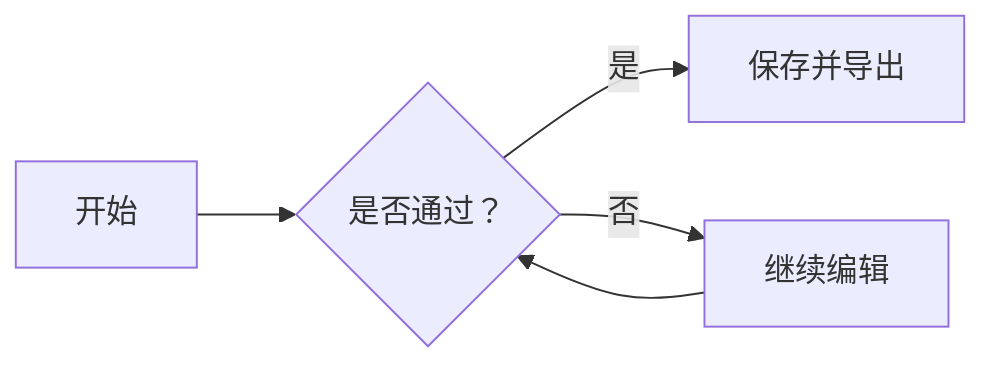
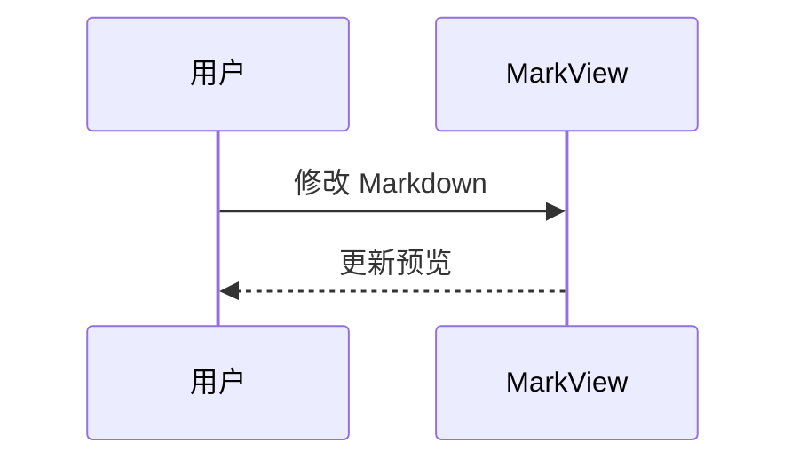

# Mermaid 中文图表

这是可选择的正文，图表会随编辑更新。


```mermaid
flowchart LR
  A[开始] --> B{是否通过？}
  B -->|是| C[保存并导出]
  B -->|否| D[继续编辑]
  D --> B
```


```mermaid
sequenceDiagram
  participant U as 用户
  participant M as MarkView
  U->>M: 修改 Markdown
  M-->>U: 更新预览
```

```javascript
console.log('普通代码保持高亮');
```
